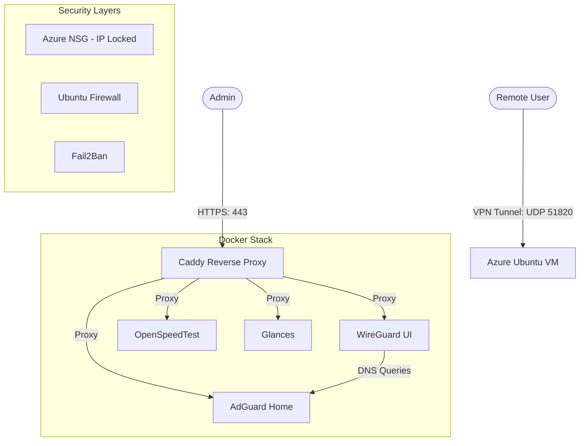

# 🛡️ Ultimate Azure VPN & Server Suite

[](https://azure.microsoft.com/)
[](https://www.docker.com/)
[](https://www.wireguard.com/)
[](https://adguard.com/)
[](https://opensource.org/licenses/MIT)

A high-performance, security-hardened, and fully automated personal VPN solution deployed on Microsoft Azure. Featuring **WireGuard**, **AdGuard Home**, **OpenSpeedTest**, and **Glances**—all secured behind **Caddy** with automatic HTTPS.

---

## ✨ Key Features

*   **🚀 One-Click Setup:** A unified PowerShell CLI (`setup.ps1`) manages everything.
*   **🔒 Hardened by Design:** IP-Locked Management, Fail2Ban, Kernel Tweaks.
*   **⚡ Performance Optimized:** MTU Tuning, 2GB Swap, Persistent Keepalive.
*   **🌐 Complete Suite:**
    *   **VPN:** WireGuard (wg-easy)
    *   **DNS:** AdGuard Home (Hardened Privacy)
    *   **Speed:** OpenSpeedTest
    *   **Health:** Glances
*   **🔄 Zero Maintenance:** **Watchtower** automatically keeps everything updated.

---

## 🏗️ Architecture



---

## 🚀 Quick Start

### 1. Run the Installer
```powershell
powershell ./setup.ps1
```

### 2. Follow the CLI Prompts
*   Select your **Azure Region** and **Resource Names**.
*   Set your **Dashboard Passwords**.
*   Confirm with `y` to deploy.

### 3. Access Your Dashboards
Once the script finishes, your secure links will be ready:
*   **WireGuard UI:** `https://vpn.<SERVER_IP>.sslip.io`
*   **AdGuard Home:** `https://adguard.<SERVER_IP>.sslip.io`
*   **SpeedTest:** `https://speed.<SERVER_IP>.sslip.io`
*   **Glances:** `https://glances.<SERVER_IP>.sslip.io`

---

## 📜 License
This project is licensed under the MIT License - see the [LICENSE](LICENSE) file for details.