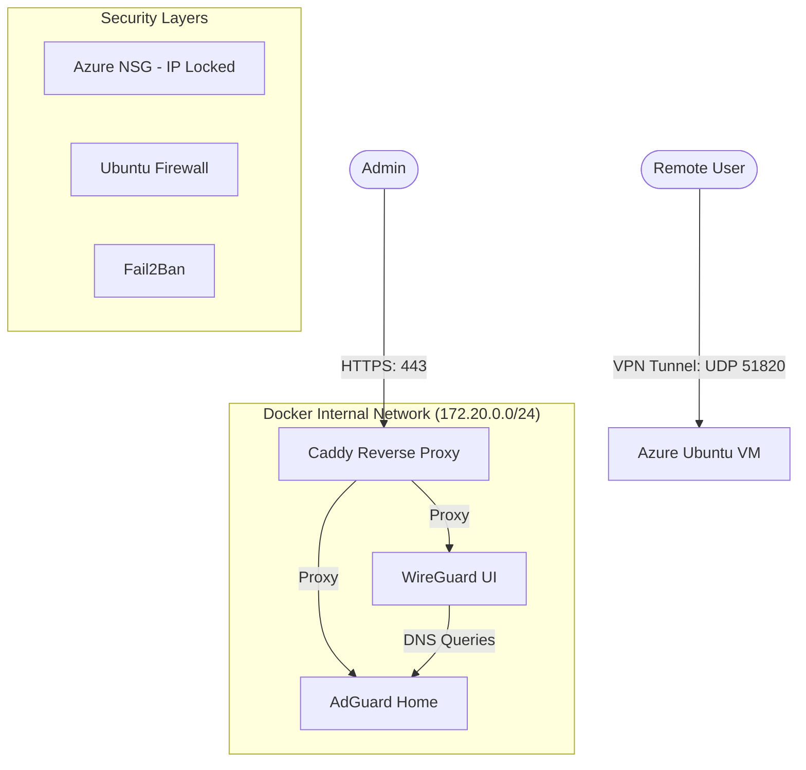

# 🛡️ Hardened Azure VPN & DNS Guard

[](https://azure.microsoft.com/)
[](https://www.docker.com/)
[](https://www.wireguard.com/)
[](https://opensource.org/licenses/MIT)

A high-performance, security-hardened, and fully automated personal VPN solution deployed on Microsoft Azure. Featuring **WireGuard** for tunneling, **AdGuard Home** for network-wide ad-blocking, and **Caddy** for automatic HTTPS.

---

## ✨ Key Features

*   **🚀 One-Click Setup:** A unified PowerShell CLI (`setup.ps1`) manages everything from Azure provisioning to SSL configuration.
*   **🔒 Hardened by Design:** 
    *   **IP-Locked Management:** SSH and Web UIs are automatically restricted to your specific Public IP.
    *   **OS Level Hardening:** Includes Fail2Ban, Kernel network tweaks, and disabled password auth.
*   **⚡ Performance Optimized:** 
    *   **MTU Tuning:** Optimized for 4G/5G and mobile network stability.
    *   **RAM Boost:** Automatic 2GB Swap file ensures stability on Azure B-series VMs.
*   **🌐 Modern Web Access:** Automatic SSL certificates via Let's Encrypt and `sslip.io` Magic DNS.
*   **🔄 Zero Maintenance:** **Watchtower** automatically keeps your VPN and DNS software updated daily.
*   **🏢 VNet Flexibility:** Deploy into a fresh environment or join an existing Azure Virtual Network.

---

## 🏗️ Architecture



---

## 🛠️ Prerequisites

Before you start, make sure you have:
1.  **Azure CLI:** Installed and logged in (`az login`).
2.  **PowerShell:** Core (pwsh) or Windows PowerShell.
3.  **SSH Key:** A public key at `~/.ssh/id_rsa.pub`.

Check your readiness with:
```powershell
powershell automation/check_requirements.ps1
```

---

## 🚀 Quick Start

### 1. Run the Installer
```powershell
powershell ./setup.ps1
```

### 2. Follow the CLI Prompts
*   Select your **Azure Region** and **Resource Names**.
*   Choose to use an **existing VNet** or create a new one.
*   Set your **Dashboard Passwords**.
*   Confirm with `y` to deploy.

### 3. Access Your Dashboards
Once the script finishes, your secure links will be ready:
*   **AdGuard Home:** `https://adguard.<SERVER_IP>.sslip.io`
*   **WireGuard UI:** `https://vpn.<SERVER_IP>.sslip.io`

> **Default User:** `admin` (for AdGuard)

---

## 🧹 Maintenance

### SSL Renewal
Since management ports are locked to your IP, automatic renewal might fail. Run this every ~80 days to trigger a manual refresh:
```powershell
powershell automation/renew_ssl.ps1
```

### Tear Down
To delete all Azure resources and stop billing:
```powershell
powershell automation/azure_destroy.ps1
```

---

## 📜 License
This project is licensed under the MIT License - see the [LICENSE](LICENSE) file for details.

---
**⭐ If you find this project useful, please consider giving it a star!**
