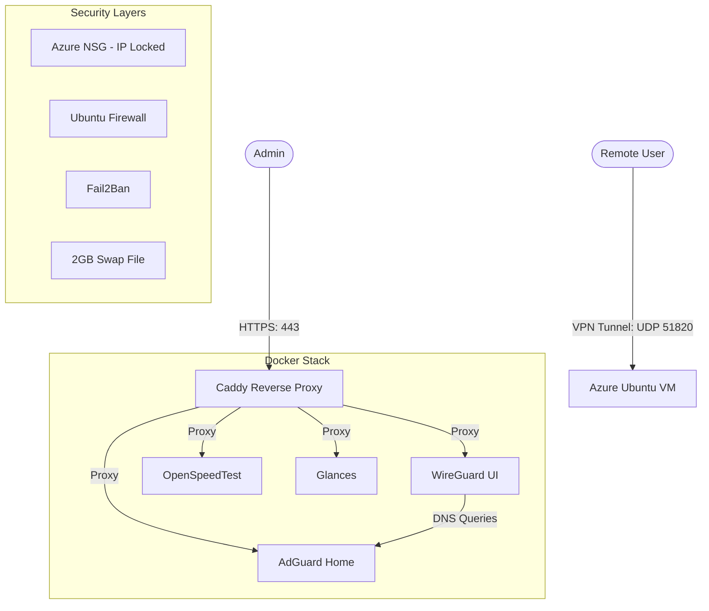

# 🛡️ Ultimate Azure VPN & Server Suite

[](https://azure.microsoft.com/)
[](https://www.docker.com/)
[](https://www.wireguard.com/)
[](https://adguard.com/)
[](https://opensource.org/licenses/MIT)

A high-performance, security-hardened, and fully automated personal VPN solution deployed on Microsoft Azure. This suite provides a complete private gateway with DNS-level ad-blocking, speed testing, and real-time monitoring.

---

## ✨ Key Features

*   **🚀 One-Click Setup:** A unified PowerShell CLI (`setup.ps1`) handles everything from resource creation to SSL.
*   **🔒 Hardened by Design:** 
    *   **IP-Locked Management:** SSH and Web UIs are restricted to your specific Public IP.
    *   **Kernel Tweaks:** Optimized network stack for high throughput and anti-spoofing.
    *   **Fail2Ban:** Automated brute-force protection for SSH.
*   **⚡ Performance Optimized:** 
    *   **MTU Tuning:** Preset to 1420 for stable mobile connections.
    *   **RAM Boost:** Automatic 2GB Swap file for stability on budget VMs.
*   **🌐 Complete Stack:**
    *   **WireGuard:** Modern, fast VPN tunneling.
    *   **AdGuard Home:** Private DNS with DNSSEC & encrypted upstreams (DoH/DoT).
    *   **OpenSpeedTest:** HTML5 based bandwidth testing.
    *   **Glances:** Real-time server resource monitoring.
*   **🔄 Zero Maintenance:** **Watchtower** automatically keeps all containers updated.

---

## 🏗️ Architecture



---

## 🚀 Quick Start

### 1. Prerequisites
*   **Azure CLI:** Installed and logged in (`az login`).
*   **SSH Key:** Public key at `~/.ssh/id_rsa.pub`.
*   **Powershell:** Core or Windows PowerShell.

### 2. Run the Installer
```powershell
powershell ./setup.ps1
```

### 3. Access Your Dashboards
Once complete, the script will provide your personalized links:
*   **VPN Admin:** `https://vpn.<SERVER_IP>.sslip.io`
*   **DNS Admin:** `https://adguard.<SERVER_IP>.sslip.io`
*   **Speed Test:** `https://speed.<SERVER_IP>.sslip.io`
*   **Monitoring:** `https://glances.<SERVER_IP>.sslip.io`

---

## 🛠️ Maintenance

### SSL Certificate Renewal
Since management ports (80/443) are locked to your IP, automatic Let's Encrypt renewal may fail. Run this every ~80 days:
```powershell
powershell automation/renew_ssl.ps1
```

### Managing Access
If your home/office IP changes and you lose access, the script will automatically detect your new IP and prompt to update the firewall rules.

### Tear Down
To remove all Azure resources and stop costs:
```powershell
powershell automation/azure_destroy.ps1
```

---

## 📜 License
Licensed under the [MIT License](LICENSE).

---
**⭐ If this project helped you, please give it a star!**
